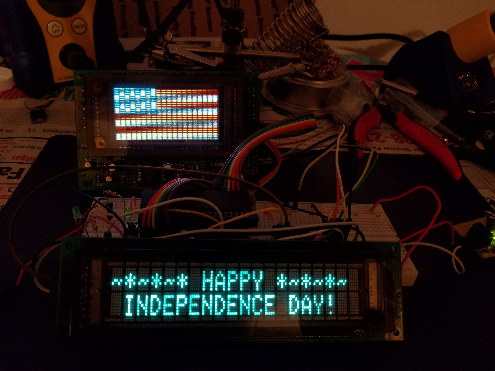
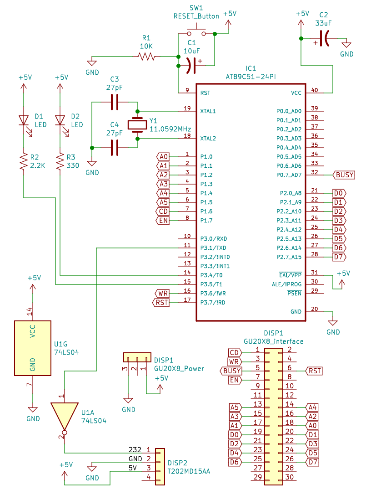

# The Bit-Banged Banner



Celebrating US Independence Day (July 4th) on Vacuum Fluorescent Displays!

A project using the Noritake Itron GU20X8 Blue/Red Graphical VFD and a Futaba T202MD15AA serial character VFD controlled by an 8051 microcontroller (AT89C51). 

A few days before July 4th, 2019, I acquired one of these bi-color graphical VFDs, and then I realized with the Blue/Red color capability it was perfect for displaying the American Flag! And thus, this project began...

## Hardware Information:

The whole circuit is powered by a 5V DC supply. I used a small homemade board with a 7805 5V regulator connected to a 12V DC wall-plug transformer, but really any 5V DC source that can supply over 1A current should be safe.

### Schematic Diagram:

Full Size PDF [here](bit_banged_banner_schem.pdf).



### Noritake Itron GU20X8:
This is a nice 20x8 pixel Blue/Red Vacuum Fluorescent Display that is controlled through a Parallel type interface. You can find these for pretty cheap from China for around $16 USD on Ebay or Aliexpress.

Some example links:
- [Link on Ebay](https://www.ebay.com/itm/20x8-VFD-Screen-Panel-3-Color-Graphical-Lattice-SCM-Vacuum-Fluorescent-Display/273373691704?ssPageName=STRK%3AMEBIDX%3AIT&_trksid=p2057872.m2749.l2649)
- [Link on Aliexpress](https://www.aliexpress.com/item/32638805488.html)

There is not a lot of documentation that I could find for these displays. But [cawapy](https://github.com/cawapy), a kind user on GitHub created a repository that documents interfacing with this device in great detail, including an Arduino Example. If you want to try these displays out, I highly recommend reading their docs.

The repository can be found here:
https://github.com/cawapy/GU20X8

Another awesome example using this display was done by user [natalie](https://hackaday.io/natalieee) on hackaday.io doing video and audio output for the Classic Japanese "Bad Apple!!" animated music video.

Link to the project:
https://hackaday.io/project/164433-bad-apple-color-vfd-ver

### Futaba T202MD15AA:
This is your typical Serial interface 20x2 Character VFD salvaged from an old Point of Sale (POS) machine.

#### Notes on interfacing with the serial character VFD:
* This display, and I believe many others like it, require an **INVERTED** serial input signal at 9600 baud. So make sure you invert the signal or you will get strange output. I used a standard 7404 Hex Inverter IC to provide the inverter for the signal. 
* As for the codec, this display can take standard 7 and 8 bit ASCII codes. So just send ASCII characters over serial and they will show up on the display.

### 8051 Microcontroller:
I used an AT89C51 which is one of many 8051 clones out there, but really any 8051 compatible chip should work, with a possible few minor modifications. 

I've been learning to use 8051 MCUs just for fun recently, so decided to use one in this project because I already had one ready to go. It's an old MCU type, but I have been enjoying it so far.

#### LEDs:
I have two LEDs attached to pins on the MCU for debugging purposes. Feel free to remove them and the code for them if you don't want the LEDs. One is a Timer interrupt driven blinker, just to show that the MCU is alive. The other debug LED will start blinking only after all the display write instructions have finished, to verify that nothing is getting stuck, like waiting for the display "BUSY" signal to go LOW, or something else.

## Programming Information:
For the Code, I used the Open Source [Small Device C Compiler (sdcc)](http://sdcc.sourceforge.net/) for compilation. I used a Mac this time, but it should work on Linux as well. Don't know much for Windows, but it's probably similar. On Mac this can be installed using [HomeBrew](https://brew.sh/) with `brew install sdcc`. On Linux, you can use your package manager, or just install from source.

### Compilation:
To compile the code simply use `sdcc` like so:
```
sdcc main.c
```

After compilation you need to convert the Intel Hex `*.ihx` output to a regular hex file `*.hex`.
You can do this using the `packihx` tool that comes with SDCC.

To convert the `main.ihx` file and write the output to the new file `main.hex`:
```
packihx main.ihx > main.hex
```

### Flashing the Microcontroller:
To Flash the Microcontroller I used the TL866CS MiniPro Programmer, which seems to be able to flash almost any MCU or EPROM I've found. Any TL866 version should work.
I use this programmer because it has a great Open Source tool available for it called `minipro` which you can find here:
https://gitlab.com/DavidGriffith/minipro/

To flash we use the tool `miniprohex` from minipro, as it can flash using a `*.hex` file. The programming command I used is below. **NOTE:** If you are using a different 8051 clone instead of the `at89c51` then make sure to change that part of the command.
```
miniprohex -p at89c51 -w main.hex -s
```

